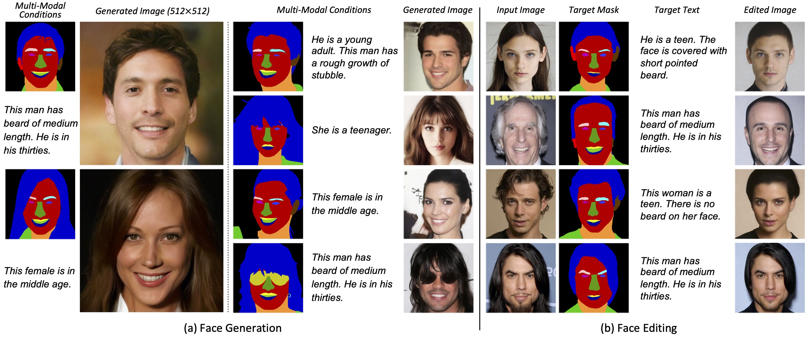

# Collaborative Diffusion (CVPR 2023)


<!-- [](https://huggingface.co/spaces/Ziqi/ReVersion) -->

This repository contains the implementation of the following paper:
> **Collaborative Diffusion for Multi-Modal Face Generation and Editing**<br>
> [Ziqi Huang](https://ziqihuangg.github.io/), [Kelvin C.K. Chan](https://ckkelvinchan.github.io/), [Yuming Jiang](https://yumingj.github.io/), [Ziwei Liu](https://liuziwei7.github.io/)<br>
IEEE/CVF International Conference on Computer Vision (**CVPR**), 2023

From [MMLab@NTU](https://www.mmlab-ntu.com/) affiliated with S-Lab, Nanyang Technological University

<!-- [[Paper](https://arxiv.org/abs/2303.13495)] | -->
[[Project Page](https://ziqihuangg.github.io/projects/collaborative-diffusion.html)]
<!-- [[Video](https://www.youtube.com/watch?v=pkal3yjyyKQ)] | -->
<!-- [[Dataset (coming soon)]()] -->
<!-- [[Huggingface Demo](https://huggingface.co/spaces/Ziqi/ReVersion)] | -->


## Overview
<!--  -->


We propose **Collaborative Diffusion**, where users can use multiple modalities to control face generation and editing.
    *(a) Face Generation*. Given multi-modal controls, our framework synthesizes high-quality images consistent with the input conditions.
    *(b) Face Editing*. Collaborative Diffusion also supports multi-modal editing of real images with promising identity preservation capability.
## Updates
<!-- - [04/2023] Integrated into [Hugging Face 🤗](https://huggingface.co/spaces) using [Gradio](https://github.com/gradio-app/gradio). Try out the online Demo: [](https://huggingface.co/spaces/Ziqi/ReVersion)
- [03/2023] [Arxiv paper](https://arxiv.org/abs/2303.13495) available.
- [03/2023] Pre-trained models with relation prompts released at [this link](https://drive.google.com/drive/folders/1apFk6TF3pGH00hHF1nO1S__tDlrcLQAh?usp=sharing).
- [03/2023] [Project page](https://ziqihuangg.github.io/projects/reversion.html) and [video](https://www.youtube.com/watch?v=pkal3yjyyKQ) available. -->
- [04/2023] Inference code for multi-modal face generation (512x512) released.


## Installation

1. Clone repo

   ```bash
   git clone https://github.com/ziqihuangg/Collaborative-Diffusion
   cd Collaborative-Diffusion
   ```

2. Create conda environment.<br>
If you already have an `ldm` environment installed according to [LDM](https://github.com/CompVis/latent-diffusion#requirements), you do not need to go throught this step (i.e., step 2). You can simply `conda activate ldm` and jump to step 3.

   ```bash
    conda env create -f environment.yaml
    conda activate codiff
   ```

3. Install dependencies

   ```bash
    pip install transformers==4.19.2 scann kornia==0.6.4 torchmetrics==0.6.0
    conda install -c anaconda git
    pip install git+https://github.com/arogozhnikov/einops.git
   ```

## Download
1. Download the pre-trained models from [here](https://drive.google.com/drive/folders/1bgrd7roog8C0ZGRakUSguCH9kjNBaaWF?usp=sharing).

2. Put the models under `pretrained` as follows:
    ```
    Collaborative-Diffusion
    └── pretrained
        ├── 512_codiff_mask_text.ckpt
        ├── 512_mask.ckpt
        ├── 512_text.ckpt
        └── 512_vae.ckpt
    ```

## Generation
You can control face generation using text and segmentation mask.
1. `mask_path` is the path to the segmentation mask, and `input_text` is the text condition.

    ```bash
    python generate_512.py \
    --mask_path test_data/512_masks/27007.png \
    --input_text "This man has beard of medium length. He is in his thirties."
    ```
    ```bash
    python generate_512.py \
    --mask_path test_data/512_masks/29980.png \
    --input_text "This woman is in her forties."
    ```

2. You can view different types of intermediate outputs by setting the flags as `1`. For example,  to view the *influence functions*, you can set `return_influence_function` to `1`.

    ```bash
    python generate_512.py \
    --mask_path test_data/512_masks/27007.png \
    --input_text "This man has beard of medium length. He is in his thirties." \
    --ddim_steps 10 \
    --batch_size 1 \
    --save_z 1 \
    --return_influence_function 1 \
    --display_x_inter 1 \
    --save_mixed 1
    ```
    Note that producing intermediate results might consume a lot of GPU memory, so we suggest setting `batch_size` to `1`, and setting `ddim_steps` to a smaller value (e.g., `10`) to save memory and computation time.

## Training

### Training Dynamic Diffusers

The code for training the *Dynamic Diffusers* will be released soon.

### Training Uni-Modal Diffusion Models

The code for training the uni-modal diffusion models will be released soon.

## Citation

   If you find our repo useful for your research, please consider citing our paper:

   ```bibtex
    @InProceedings{huang2023collaborative,
        author = {Huang, Ziqi and Chan, Kelvin C.K. and Jiang, Yuming and Liu, Ziwei},
        title = {Collaborative Diffusion for Multi-Modal Face Generation and Editing},
        booktitle = {Proceedings of the IEEE/CVF Conference on Computer Vision and Pattern Recognition},
        year = {2023},
    }
   ```


## Acknowledgement

The codebase is maintained by [Ziqi Huang](https://ziqihuangg.github.io/).

This project is built on top of [LDM](https://github.com/CompVis/latent-diffusion).